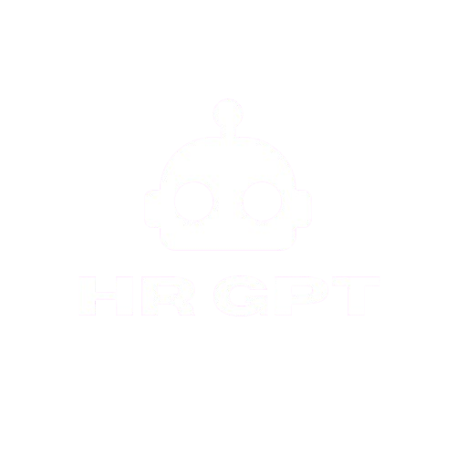
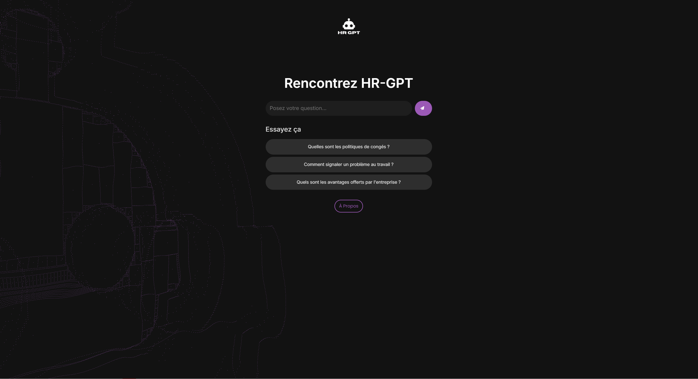

# HR-GPT

<p align="center">
  
</p>

## Description

**HR-GPT** est un assistant virtuel qui automatise l'accès aux politiques d'entreprise. Grâce à l'intelligence artificielle et à l'intégration de modèles Hugging Face, il permet aux employés de poser des questions en langage naturel et d'obtenir des réponses précises à partir de documents internes (politiques de congés, remboursements, etc.).

## Fonctionnalités

- **Base de Connaissances** : Accès aux politiques internes stockées dans l'app.
- **Assistant Conversationnel** : Réponses aux questions courantes grâce à un modèle de langage fine-tuné de Hugging Face.
- **Système de Recommandation** : Suggestions personnalisées basées sur les rôles et les besoins des employés.
- **Notifications** : Alertes sur les mises à jour des politiques et rappels de conformité.


## Technologies Utilisées

- **Langage de Programmation** : Python
- **Framework** : Flask
- **Modèles** : Openai-ai-4o-mini
- **Infrastructure Cloud** : Google cloud pour le déploiement et la gestion des services
- **Stockage** : interne au container flask pour l'instant

## Installation


### Étapes d'installation

1. Clonez le repository :

   ```bash
   git clone https://github.com/votre_nom_utilisateur/HR-GPT.git
   cd HR-GPT
   ```

## Utilisation

Lancez l'application Flask :

```bash
docker-compose up --build
```

Accédez à l'interface utilisateur via [http://localhost:5000](http://localhost:5000).


## License

Ce projet est sous la licence MIT. Voir le fichier [LICENSE](LICENSE) pour plus de détails.

## Contact

Pour toute question, n'hésitez pas à me contacter à l'adresse [kpharci@gmail.com](mailto:kpharci@gmail.com).


